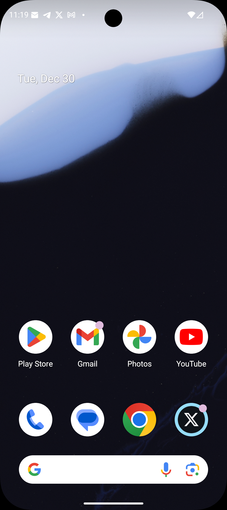

# Mobile Agent (UI-TARS 7B)

[](https://github.com/gss10282023/mobile_agent/actions/workflows/lint.yml)
[](https://github.com/gss10282023/mobile_agent/actions/workflows/test.yml)
[](LICENSE)
[](pyproject.toml)
[](https://github.com/astral-sh/ruff)

Control Android devices with UI-TARS 7B: screenshot -> model inference -> action parsing -> device execution.

<p align="center">
  
</p>

## Highlights
- End-to-end UI automation loop with a consistent action space.
- Works with real devices or emulators via adb/uiautomator2.
- Dry-run mode for safe debugging before real clicks.
- Pluggable model strategy (OpenRouter by default).

## Tech stack
- Python >= 3.10, CLI via `argparse` (`mobile_agent/cli.py`).
- Device automation via `uiautomator2` with an ADB screenshot fallback (`mobile_agent/screenshot_tool.py`).
- Model invocation via OpenAI-compatible chat completions (`openai` SDK), OpenRouter by default (`mobile_agent/model_strategies.py`).
- UI-TARS prompt + parsing + execution:
  - Prompt template: `ui_tars_7b_kit/prompts.py`
  - Action parser: `ui_tars_7b_kit/action_parser.py`
  - Coordinate mapping + executor: `ui_tars_7b_kit/action_executor.py`

## Prerequisites
- `adb` (Android platform-tools) on your `PATH`.
- Android device/emulator with USB debugging enabled (`adb devices` should list it).
- Network access to your model provider (OpenRouter by default).

## Quickstart (3 minutes)
1) Create a virtualenv and install:
```bash
python3 -m venv .venv && source .venv/bin/activate
pip install --upgrade pip
pip install -e .
```

2) Set environment variables:
```bash
export OPENROUTER_API_KEY="<your_openrouter_key>"
# Optional: OpenRouter best practices (passed as request headers)
export OPENROUTER_SITE_URL="https://your.site"
export OPENROUTER_SITE_NAME="mobile-agent"
```
See `.env.example` for a template.

3) Run a dry-run command:
```bash
mobile-agent --dry-run 1 -i "Open Settings and go to Wi-Fi"
```

Optional:
- Real device execution: `mobile-agent --dry-run 0 --serial "<device_serial>" -i "Open Settings and go to Wi-Fi"`
- Save run artifacts: `--save-runs`
- Logging level: `--log-level debug|info|warning|error`

To install from PyPI (once published): `pip install mobile-agent`.

## CLI notes
Run `mobile-agent --help` for the full list. Common options:
- `--dry-run 1|0`: print actions only vs execute on device.
- `--serial "<device_serial>"`: target a specific device.
- `--rotation 0|90|180|270`: rotate render-to-device coordinate mapping.
- `--history-n N`: include N previous (image, output) pairs as context (0 disables).
- `--base-url` / `--api-key`: point to any OpenAI-compatible endpoint (defaults to OpenRouter).
- `--save-runs`: persist `runs/<timestamp>/` artifacts for debugging.

## Action format (UI-TARS)
The model is prompted to output exactly one `Action:` per step (see `ui_tars_7b_kit/prompts.py`).
Supported actions:
- `click(point='<point>x y</point>')`, `long_press(point='<point>x y</point>')`
- `type(content='...')` (append `\\n` to submit)
- `scroll(point='<point>x y</point>', direction='up|down|left|right')`
- `drag(start_point='<point>x1 y1</point>', end_point='<point>x2 y2</point>')`
- `open_app(app_name='...')`, `press_home()`, `press_back()`, `wait()`, `hotkey(key='enter|back|home')`
- `finished(content='...')`

## Run artifacts (`--save-runs`)
Writes debugging artifacts to `runs/<timestamp>/`:
- `runs/<timestamp>/metadata.json`
- `runs/<timestamp>/steps/step_001.png`
- `runs/<timestamp>/steps/step_001.json` (instruction, model output, parsed action, execution results)

## Safety and compliance
- Real-device actions can be destructive. Start with `--dry-run 1` and test on non-production devices.
- You are responsible for complying with device/app/service terms and local laws.
- This repository does not ship model weights. Obtain model access separately and follow the model's license/terms.

## Data and privacy
- This project does not include telemetry.
- When you run it, screenshots and prompts are sent to your configured model provider for inference. Avoid sensitive data unless you have permission and understand provider policies.

See `THIRD_PARTY_NOTICES.md` for dependency licenses and service terms.

## Architecture
```
[Android Screen]
      |
      v
[Screenshot] -> [UI-TARS Model] -> [Action Parser] -> [ADB Executor] -> [Device Actions]
```

Notes:
- Screenshot capture uses `uiautomator2` first, then falls back to `adb exec-out screencap -p`.
- Model outputs use render-space pixel coordinates; execution maps them to device pixels (rotation-aware).

## FAQ
- adb not found: install Android platform-tools and ensure `adb` is on your PATH.
- Device unauthorized: accept the USB debugging prompt and replug the device.
- Coordinates drift: ensure device rotation matches `--rotation`, and avoid screen resizing.
- Output parsing errors: verify the model output follows the Action format in `ui_tars_7b_kit/prompts.py`.

## Known issues
- UI layouts can differ across OEM skins, causing unexpected element placement.
- Screenshot capture may fail on flaky connections; reconnect the device and retry.
- Some input methods block automation or ignore programmatic input.

## Roadmap
See `ROADMAP.md`.

## Development
```bash
pip install -e ".[dev]"
ruff check .
pytest
```
